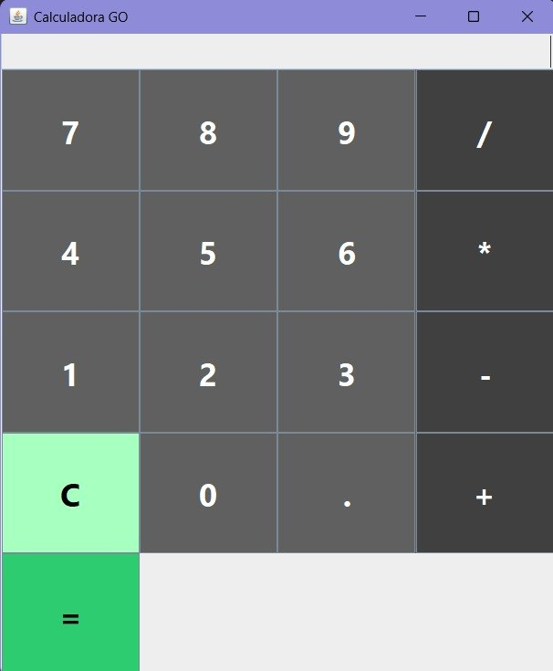

# Java Swing Calculator

A desktop calculator application built with Java and Swing, following the **Model-View-Controller (MVC)** architecture.

This project is part of my personal portfolio and has been developed to strengthen my understanding of object-oriented programming, software architecture, and desktop application development with Java.

---

## 📸 Screenshots

### Application

)

### Project Structure (MVC)

)

---

## 🚀 Features

- Basic arithmetic operations (addition, subtraction, multiplication, and division)
- Desktop graphical user interface built with Java Swing
- MVC architecture with clear separation of responsibilities
- Error handling for invalid operations
- Continuous improvements to the user interface and functionality

---

## 🛠️ Technologies

- Java
- Java Swing
- MVC (Model-View-Controller)
- Git & GitHub

---

## 📂 Project Structure

The application follows the MVC design pattern to keep the code organized and maintainable.

- **Model** – Contains the business logic and mathematical operations.
- **View** – Manages the graphical user interface.
- **Controller** – Handles user interactions and coordinates communication between the Model and the View through event listeners.

---

## 📚 Learning Outcomes

Through this project I have strengthened my understanding of:

- Object-Oriented Programming (OOP)
- Separation of concerns using the MVC architecture
- Event-driven programming with Java Swing
- Code organization and maintainability
- Version control using Git and GitHub

One of the most valuable lessons from this project has been learning to analyze a problem before looking for a solution.

For example, while implementing number formatting, I realized that I didn't need to change the value itself—I only needed to display it differently to the user. That experience reinforced the importance of clearly understanding the problem before writing code.

---

## 🚧 Project Status

This project is currently under active development.

### Planned Improvements

- Percentage (%) operation
- Square root function
- Additional interface improvements
- Code refactoring and optimization

---

## 📌 Purpose

The goal of this project is not only to build a functional calculator but also to apply software engineering principles such as clean architecture, separation of responsibilities, and maintainable code while continuously improving my Java development skills.