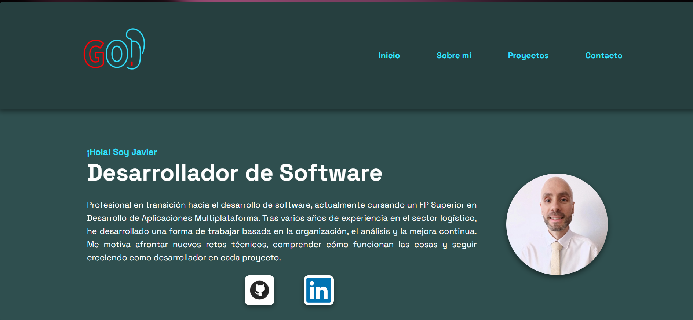

# Portfolio GO
 
## Project Description
 
Portfolio GO is my personal software development portfolio. It showcases my projects, technical skills, and professional growth through projects developed with a focus on software engineering best practices, version control, documentation, and continuous improvement.
 
---
 
## Objectives
 
- Showcase my personal software development projects.
- Apply software engineering best practices.
- Build a professional portfolio for future job opportunities.
- Continuously improve the project as I learn new technologies.
---
 
## Technologies
 
Current technologies:
 
- HTML5
- CSS3 (organized by section/component)
- Responsive Design (mobile-first)
- Git
- GitHub
Future technologies:
 
- JavaScript
- Additional technologies as the project evolves
---
 
## Project Structure
 
```text
portfolio-go/
│
├── assets/
│   ├── css/
│   │   ├── styles.css      # Global styles / variables / resets
│   │   ├── header.css
│   │   ├── hero.css
│   │   ├── about.css
│   │   ├── skills.css
│   │   ├── projects.css
│   │   ├── contact.css
│   │   └── footer.css
│   │
│   ├── images/
│   │   ├── portfolio-go/    # Screenshots and images for this project
│   │   ├── calculator-go/
│   │   └── centimo-a-centimo/
│   │
│   ├── js/                  # (Coming soon)
│   └── videos/
│
├── docs/
│   ├── PROJECT-CHARTER.md
│   ├── CHANGELOG.md
│   └── IDEAS.md
│
├── .idea/                   # IDE config (ignored)
├── out/                     # Build output (ignored)
├── .gitignore
├── index.html
└── README.md
```
 
---
 
## Project Status
 
**Current version: v0.2.0**
 
| Version | Status | Description |
|---------|--------|--------------|
| v0.1.0  | ✅ Released | Full project architecture and base HTML structure |
| v0.2.0  | ✅ Released | Complete CSS styling, organized by section, with full responsive design |
| v0.3.0  | 🔜 Planned | Custom domain, Cloudflare Pages hosting, and production deployment |
| v0.4.0  | 🔜 Planned | JavaScript functionality |
 
See [CHANGELOG.md](docs/CHANGELOG.md) for full version history and details.
 
---
 
## Screenshots
 

 
---
 
## Versioning
 
This project follows **Semantic Versioning (SemVer)**.
 
Each stable version is identified with a Git tag and documented through GitHub Releases and the project [CHANGELOG.md](docs/CHANGELOG.md).
 
---
 
## Author
 
**Javier Gallegos**
 
Software Developer Student (DAM)
 
GitHub: https://github.com/JaviGOH
